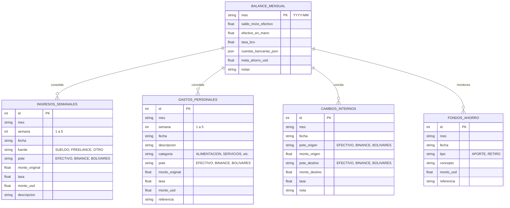

# Especificación de Requerimientos: Módulo de Cuadre Financiero Personal

**Feature Branch**: `001-cuadre-financiero-personal`  
**Fecha**: 2026-10-02  
**Estado**: Especificación y Planificación Inicial  
**Referencia**: Adaptación de `APH/routes/api_cuadre.py` y `APH/templates/cuadre.html` para Finanzas Personales.

---

## 1. Visión y Objetivos

Reestructurar y adaptar la arquitectura contable y financiera del sistema de "Cuadre de Caja" (originario de APH) a un **entorno de finanzas personales**. El objetivo es proporcionar un control milimétrico del flujo de caja, liquidez multimoneda y patrimonio neto personal, manteniendo la disciplina matemática y visual del modelo probado pero eliminando la complejidad comercial.

### Diferencias Clave con el Cuadre Comercial de APH:
1. **Fuentes de Ingresos**: Se reemplaza el concepto de "Ventas de Mostrador" por **Sueldos/Salarios** y **Otras Fuentes de Ingresos** (ingresos independientes, freelance, inversiones, remesas, rendimientos).
2. **Sin Módulo de Compras**: Se **elimina por completo** el apartado de compras a proveedores, órdenes de compra, control de recepciones y deuda a proveedores.
3. **Mantenimiento Estricto de Gastos**: El registro de gastos personales se preserva **tal cual**, desglosado por canal/pote de desembolso (Efectivo $, Binance USDT, Bolívares Bs con conversión a tasa y semana).
4. **Los 3 Potes de Liquidez**: Preservados en su totalidad:
   - **Pote 1: Efectivo ($ USD)** (Caja física personal).
   - **Pote 2: Binance (USDT)** (Billeteras digitales, transferencias cripto P2P).
   - **Pote 3: Bolívares (Bs)** (Cuentas bancarias en moneda local con tasa de cambio a $).
5. **Ganancias vs Pérdidas Adaptado (Balance Personal)**:
   - Conciliación de Arqueo físico de efectivo (Teórico vs "En Mano").
   - Superávit / Déficit neto del mes (Ingresos Personales vs Gastos).
   - Patrimonio líquido total consolidado en USD en los 3 potes.
   - Fondo de Ahorro acumulado y aportes mensuales.

---

## 2. Historias de Usuario

### User Story 1 - Registro Dinámico de Ingresos Personales por Pote (Priority: P1)
**Como** usuario,  
**quiero** registrar mis ingresos periódicos (sueldo fijo, comisiones, honorarios o freelance) a medida que ocurren, asignándolos a cualquiera de los 3 potes (Efectivo, Binance o Bolívares),  
**para** mantener un control ágil y dinámico sin tener que llenar filas vacías de días donde no percibo dinero.

**Criterios de Aceptación**:
1. El usuario puede registrar un ingreso con fecha, semana del mes (1 a 5 calculada automáticamente), concepto/descripción, fuente (`Sueldo / Salario Fijo`, `Honorarios Profesionales`, `Freelance / Proyectos`, `Inversiones / Rendimientos`, `Remesas / Familia`, `Entrada Extraordinaria`), pote/moneda (`EFECTIVO`, `BINANCE`, `BS`), monto original, tasa de cambio (para Bs) y referencia.
2. La interfaz ofrece filtro segmentado por Pote (`Todos`, `Efectivo`, `Binance`, `Bolívares`) con conteo de registros y KPIs de cabecera por pote.
3. Se muestra un resumen desglosado por semanas (Semana 1..5) en chips y la tabla de entradas registradas con opción de eliminación.

---

### User Story 2 - Registro de Gastos Clasificados por Pote (Priority: P1)
**Como** usuario,  
**quiero** registrar mis egresos diarios indicando desde qué pote salieron los fondos (Efectivo, Binance o Bolívares),  
**para** mantener la integridad del saldo de cada canal y analizar mis categorías de gasto.

**Criterios de Aceptación**:
1. Formulario de gasto con fecha, semana automática, concepto/descripción, categoría (Alimentación, Servicios, Transporte, etc.), pote/moneda, monto original, tasa (si aplica) y monto en USD.
2. Filtro segmentado interactivo: [Todos] [Efectivo ($)] [Binance (USDT)] [Bolívares (Bs)].
3. Cálculo en tiempo real de subtotales por pote y total general de egresos.

---

### User Story 3 - Transferencias entre Potes (Cambios Internos) y Aportes (Priority: P2)
**Como** usuario,  
**quiero** registrar movimientos de dinero entre mis potes (ej. vender USDT en Binance para recibir Bs en Banesco, o retirar Efectivo para fondear USDT),  
**para** que el saldo de cada pote refleje exactamente la realidad financiera sin distorsionar los ingresos o gastos operativos.

**Criterios de Aceptación**:
1. Registro de cambio interno con pote origen, monto origen, pote destino, monto destino, tasa aplicada y nota explicativa.
2. El sistema actualiza los saldos netos de cada pote sin alterar las cuentas de ingresos ni gastos del mes.
3. Posibilidad de registrar "Inyecciones / Aportes Externos" extraordinarios.

---

### User Story 4 - Fondo de Ahorros y Metas (Priority: P2)
**Como** usuario,  
**quiero** separar dinero para ahorro o fondo de emergencia desde mi flujo operativo,  
**para** asegurar el cumplimiento de metas financieras sin que ese dinero esté disponible para gasto diario.

**Criterios de Aceptación**:
1. Visualización del saldo acumulado inicial del mes anterior.
2. Registro de aportes (egreso de la caja operativa hacia ahorro) y retiros justificados del fondo de ahorro.
3. Totalización del saldo neto acumulado en el fondo de ahorro.

---

### User Story 5 - Balance Mensual y Cuadre de Arqueo (Priority: P1)
**Como** usuario,  
**quiero** ver la hoja de Balance Mensual consolidada con arqueo de efectivo y resultado neto,  
**para** saber exactamente cuánto dinero gané/ahorré en el mes y verificar que el efectivo físico coincida con el cálculo matemático.

**Criterios de Aceptación**:
1. **Arqueo de Efectivo**: Campo para ingresar "Efectivo en Mano" (conteo físico). El sistema calcula el "Efectivo Teórico" y muestra si está `CUADRADO`, `SOBRANTE` o `FALTANTE`.
2. **Saldo Neto por Pote**: Desglose claro de Entradas - Salidas +/- Cambios = Saldo Neto para Efectivo, Binance y Bolívares.
3. **Resultado Neto del Mes**: `Total Ingresos - Total Gastos = Superávit / Déficit`.
4. **Liquidez Total Consolidada**: Suma en USD de saldos en efectivo físico, wallet Binance USDT y cuentas bancarias en Bs convertidas a la tasa oficial/de mercado.

---

## 3. Modelo de Datos Conceptual

---

## 4. Reglas Financieras y Fórmulas Matemáticas

1. **Precisión Numérica**: Todos los cálculos monetarios deben usar redondeo estricto a 2 decimales (`round(val, 2)`).
2. **Conversión Bolívares a Dólares**:
   $$\text{Monto USD} = \frac{\text{Monto en Bs}}{\text{Tasa}}$$
3. **Efectivo Teórico Disponible**:
   $$\text{Efectivo Teórico} = \text{Saldo Inicial} + \text{Ingresos Efectivo} - \text{Gastos Efectivo} - \text{Aportes Ahorro Efectivo} + \text{Cambios Netos Efectivo} + \text{Aportes Extraordinarios}$$
4. **Diferencial de Arqueo**:
   $$\text{Diferencia} = \text{Efectivo en Mano} - \text{Efectivo Teórico}$$
   - Si $|\text{Diferencia}| < 0.01$: `CUADRADO`.
   - Si $\text{Diferencia} > 0.01$: `SOBRANTE`.
   - Si $\text{Diferencia} < -0.01$: `FALTANTE`.
5. **Superávit / Rendimiento Neto Personal**:
   $$\text{Resultado Neto} = \text{Ingresos Totales} - \text{Gastos Totales}$$
6. **Patrimonio Líquido Consolidado (USD)**:
   $$\text{Patrimonio Líquido} = \text{Efectivo en Mano} + \text{Saldo Binance USDT} + \sum \left(\frac{\text{Saldos Cuentas Bs}}{\text{Tasa BCV}}\right) + \text{Fondo Ahorro Acumulado}$$
